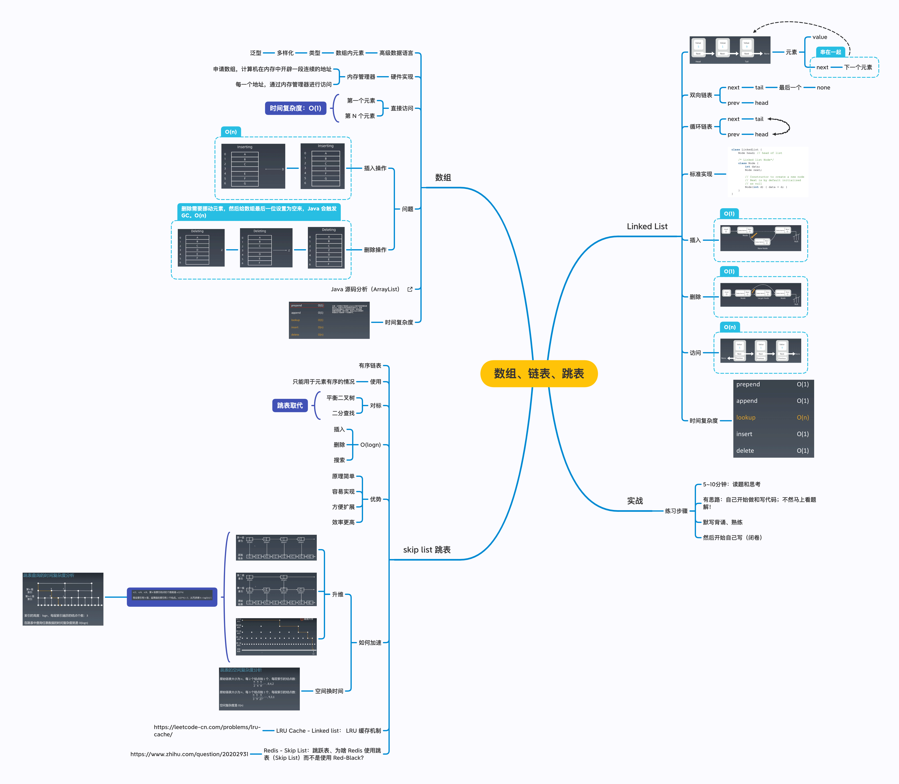

学习笔记

### 预习:

### 第3课：数组、链表、跳表

### 第4课：栈、队列、优先队列、双端队列

### 五毒神掌：
工欲善其事，必先利其器。

为了方便练习，周六抽了半天时间，弄了个小工具。方便查看每日 todoList。

https://github.com/gilzhao/5times/tree/master/packages/app-5times-todoist

本周，每日练习还都只做了一遍；下周有了 5times-todoist 小工具，可以更好的跟进练习。

### 遇到的问题
时间安排是个难题。希望在这 10 个星期的学习过程中，除了提高算法技能，也能高效的安排好自己的时间。

### 每周精进一小步
本周跟进每日一题，希望下周，能在会做的基础上，再记录一下解题思路，强化学习效果。